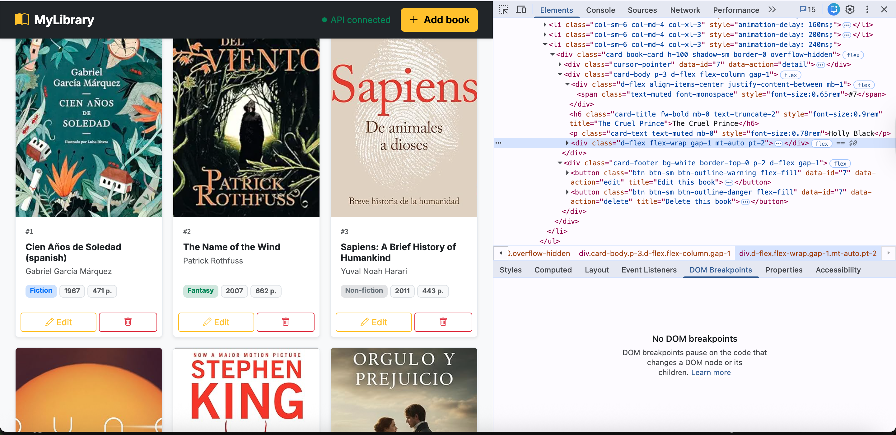
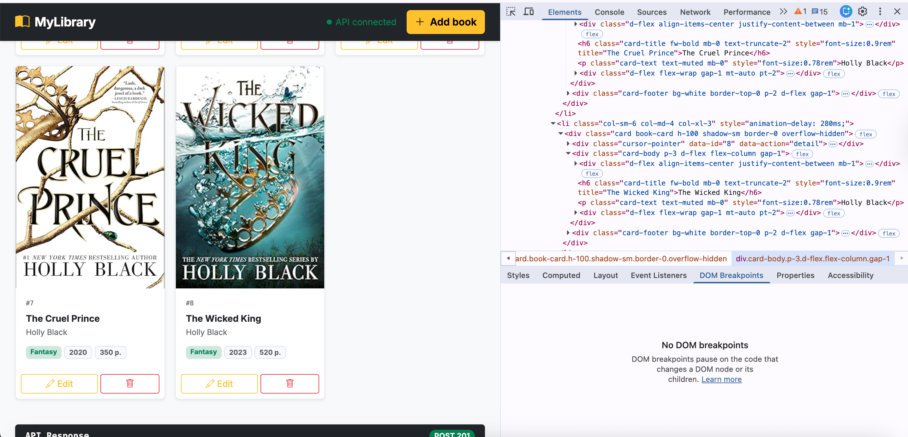
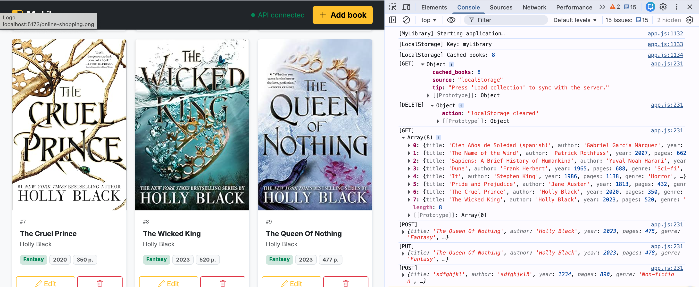
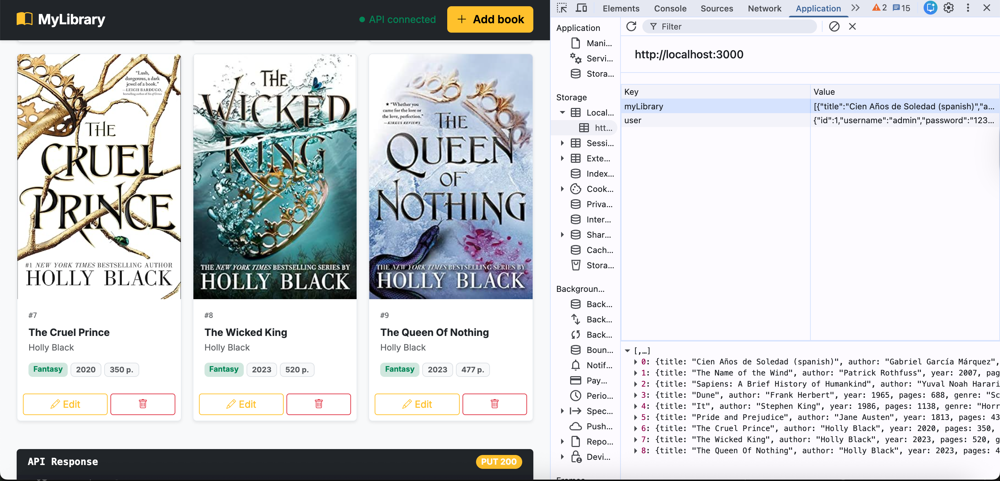

# 📚 MyLibrary

Gestor de colección personal de libros construido con JavaScript vanilla, Bootstrap 5 y JSON Server. Desarrollado como proyecto final del Módulo 3, cubriendo manipulación del DOM, persistencia en LocalStorage y operaciones CRUD completas mediante la Fetch API.

- [Ver Readme en Inglés](README.md)

---

## ✨ Funcionalidades

- **CRUD completo** — Crear, leer, actualizar y eliminar libros a través de una interfaz limpia basada en modales
- **Búsqueda en tiempo real** — Filtra por título o autor mientras escribes
- **Filtro por género** — Reduce la colección por género desde el panel lateral
- **Caché en LocalStorage** — Los libros persisten entre sesiones; la app carga los datos en caché al instante sin esperar al servidor
- **Modo sin conexión** — Si JSON Server no está disponible, los datos del caché se muestran automáticamente con un badge "Cache"
- **Log de API en vivo** — Cada respuesta del servidor se muestra como JSON formateado en el panel derecho
- **Historial de sesión** — Registro con marca de tiempo de cada operación realizada durante la sesión
- **Imágenes de portada** — Los libros pueden incluir una URL de portada; las imágenes rotas caen automáticamente a un placeholder con gradiente por género
- **Barra de estadísticas** — Contadores en tiempo real de libros totales, páginas acumuladas y géneros distintos
- **Diseño responsivo** — Grid de tres columnas que colapsa correctamente en pantallas pequeñas

---

## 🗂 Estructura del proyecto

```
M3S4/
├── public/
│   ├── index.html       # Estructura de la app — layout, modales, Bootstrap CDN
│   ├── app.js           # Toda la lógica de la aplicación (CRUD, DOM, LocalStorage)
│   └── style.css        # Estilos personalizados que complementan Bootstrap
├── db.json              # Base de datos de JSON Server — 7 libros de ejemplo
├── package.json         # Metadatos del proyecto y scripts
├── package-lock.json
├── .gitignore
└── README.md
```

---

## 🛠 Stack tecnológico

| Capa | Tecnología |
|---|---|
| Framework UI | Bootstrap 5.3 + Bootstrap Icons 1.11 |
| Lógica | JavaScript vanilla ES6+ |
| Fuentes | Inter (Google Fonts) |
| Simulación de API | JSON Server 1.x |
| Persistencia | LocalStorage del navegador |

---

## 🚀 Cómo ejecutar el proyecto

### Requisitos previos

- Node.js 18 o superior
- npm

### Instalación

```bash
# 1. Clonar el repositorio
git clone <url-del-repositorio>
cd M3S4

# 2. Instalar dependencias
npm install
```

### Ejecutar la app

```bash
# Inicia JSON Server (sirve db.json en el puerto 3000 y los archivos estáticos de /public)
npm start
```

Luego abre el navegador en:

```
http://localhost:3000
```

> JSON Server sirve la carpeta `public/` como archivos estáticos automáticamente, por lo que tanto la API como la UI corren en el mismo puerto.

---

## 📡 Referencia de la API

URL base: `http://localhost:3000`

| Método | Endpoint | Descripción |
|---|---|---|
| `GET` | `/books` | Retorna todos los libros |
| `POST` | `/books` | Crea un nuevo libro (el id lo asigna el servidor) |
| `PUT` | `/books/:id` | Reemplaza completamente un libro por id |
| `DELETE` | `/books/:id` | Elimina un libro por id |

### Esquema del libro

```json
{
  "id":     1,
  "title":  "Dune",
  "author": "Frank Herbert",
  "year":   1965,
  "pages":  688,
  "genre":  "Sci-fi",
  "cover":  "https://…"
}
```

El campo `cover` es opcional. Todos los demás campos son obligatorios.

### Géneros soportados

`Fiction` · `Non-fiction` · `Fantasy` · `Sci-fi` · `Horror` · `Romance` · `Mystery` · `History` · `Biography`

---

## 🖼 Imágenes de portada

El campo `cover` acepta cualquier URL de imagen directa (una que al abrirla en el navegador muestre solo la imagen). Fuentes recomendadas:

- **Amazon** — clic derecho en cualquier portada → Copiar dirección de imagen
- **Open Library** — `https://covers.openlibrary.org/b/isbn/{ISBN}-L.jpg`
- **Google Books** — clic derecho en la miniatura de la portada → Copiar dirección de imagen

Si la URL falla al cargar, la app cae automáticamente a un placeholder con gradiente específico por género.

---

## 🧠 Conceptos de JavaScript aplicados

Este proyecto fue construido para demostrar los siguientes conceptos del Módulo 3:

| Concepto | Dónde aparece |
|---|---|
| `let` / `const` | Todas las declaraciones de variables en `app.js` |
| Arrays y objetos | Arreglo global `books`; objetos libro; arreglos de reglas en los validadores |
| `Map` | `genreColors` y `genreGradients` para búsquedas de género en O(1) |
| `Set` | `updateStats()` — cuenta géneros únicos en O(n) |
| Manipulación del DOM | `createElement`, `appendChild`, `removeChild` en `renderBooks` y `del` |
| LocalStorage | `saveToLS`, `syncLS` — `setItem` / `getItem` en cada mutación |
| Fetch API | `get`, `post`, `put`, `del` — una función por método HTTP |
| `async` / `await` | Todas las funciones de fetch; IIFE `init` |
| `try` / `catch` | Cada función de fetch; fallback sin servidor en `get` |
| Validación | `isNotEmpty`, `isPositive`, `isValidUrl`, `markError` |
| Delegación de eventos | Un solo listener `click` en `#book-list` maneja todos los botones de las cards |
| IIFE | `init()` — se ejecuta al cargar la página para restaurar el caché y verificar el servidor |

---

## 📋 Lista de tareas

- [x] **TASK 1** — Archivos del proyecto creados y correctamente vinculados
- [x] **TASK 2** — Entrada del usuario capturada desde el DOM; mensajes dinámicos de éxito y error
- [x] **TASK 3** — Libros renderizados como elementos `<li>` mediante `createElement` / `appendChild`; la eliminación usa `removeChild`
- [x] **TASK 4** — Arreglo global `books` sincronizado con `localStorage.setItem` / `getItem`; caché cargado al iniciar
- [x] **TASK 5** — GET, POST, PUT, DELETE implementados con `async/await` y `try/catch`
- [x] **TASK 6** — Todas las funcionalidades trabajan en conjunto; respuestas de la API registradas en el DOM y en la consola

---

## 📸 Evidencia

Las siguientes capturas documentan el comportamiento de la aplicación en las cuatro áreas clave evaluadas en la Task 6.

### DOM — Antes de la operación
El panel Elements muestra el estado inicial de `#book-list` con las cards `<li>` existentes renderizadas en el DOM antes de realizar cualquier operación.



### DOM — Después de la operación
Después de ejecutar una solicitud POST, el nuevo elemento `<li>` es agregado a `#book-list` mediante `appendChild()`. El DOM se actualiza instantáneamente sin recargar la página.



### Consola — Respuestas del servidor
Cada operación CRUD llama a `console.log(`[${method}]`, data)` dentro de `showLog()`, imprimiendo la respuesta JSON exacta retornada por JSON Server. La captura muestra los cuatro métodos — GET, POST, PUT y DELETE — registrados en secuencia.



### Application — Contenido del LocalStorage
El panel Application muestra la clave `myLibrary` almacenada en LocalStorage con todos los libros guardados por el usuario durante su sesión. El valor es el arreglo completo de libros serializado por `JSON.stringify()`. Estos datos se cargan automáticamente al iniciar mediante `JSON.parse(localStorage.getItem(LS_KEY))`, por lo que la colección persiste entre sesiones incluso cuando el servidor no está disponible.



---

## 👩‍💻 Autora

Vanessa Fontalvo Reniz — Ingeniería de Sistemas · Universidad del Norte